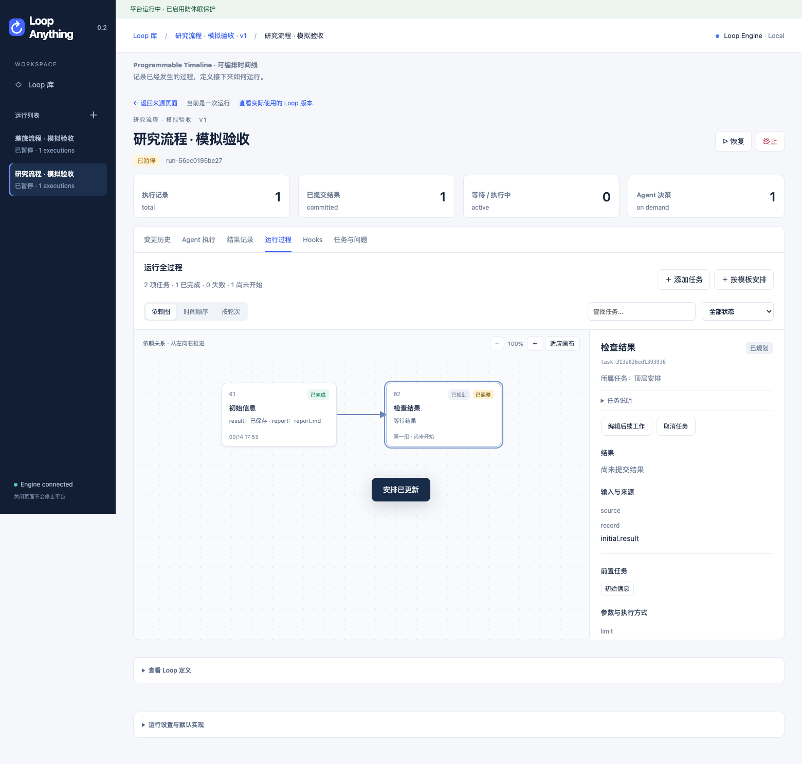
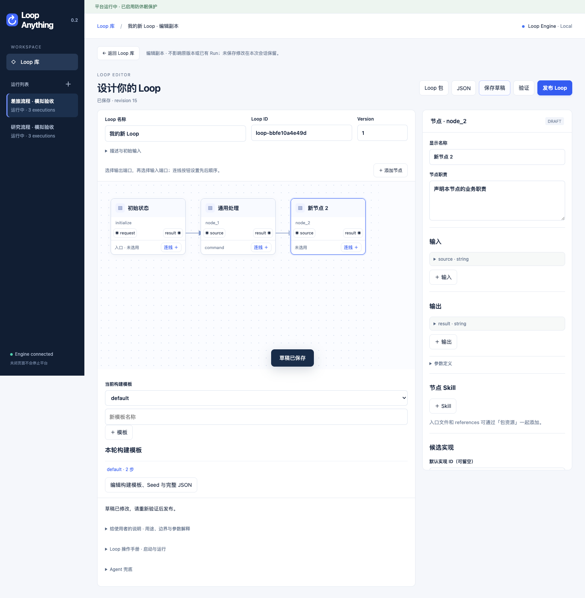

# Loop Anything

**Your agent builds it. The engine keeps it running.**

让你的 Agent 把工作安排好，让平台持续推进。你能看见每一步做了什么、得到什么结果，也能随时调整接下来怎么做。

## 看见整个过程，改变下一步

比如做一项研究：先准备数据、跑几组实验，再让 Agent 比较结果、提出下一组实验。你可以点开每一步查看结果；中途换一个研究方向，保留已有成果，修改后面的安排。

比如安排一次差旅：收集方案、等你确认、执行预订、关注行程变化。出现变化后，按你的新要求调整方案，而不是从头再来。

仓库提供这两类**模拟示例**，可先体验过程查看与调整；实际训练、预订等工作需要接入你自己的实现。



*本地工作台截图：模拟流程中的已完成结果和可以调整的后续任务。*

- **每一步都有迹可循**：看结果、输入来源和历次执行。
- **运行中也能调整**：保留已发生的过程，修改还没开始的工作。
- **和 Agent 一起设计**：说清目的，让 Agent 构建流程；也可以在画布上连接和编辑步骤。修改自动保存为草稿，准备好后“保存并使用”。
- **安排一次，持续推进**：保持平台运行，关闭网页也会继续；需要你时按配置发送通知。
- **启动前先选好**：为这次运行选择本地或远端等执行方式，在网页中与自己的 Agent 讨论，准备好再开始。
- **把好用的流程分享出去**：安装别人提供的 Loop，也能替换其中的执行方式。



你可以在网页中与自己的 Agent 讨论并启动，运行后边看过程边调整；也可以直接在终端工作。也可以通过自己选择的聊天桥接接入飞书、微信，继续查看和修改同一次运行。平台附带可选的 cc-connect 通知适配器；真实聊天渠道需在你的环境中配置和联调。

想先看一眼：[本地预览](#本地预览)。准备安装：把本 README 链接交给自己的 Agent，让它按下面的说明完成。

## 安装平台

平台安装是一次性准备。把本 README 链接交给自己的 Agent，让它完成下面的步骤；日常操作使用平台 Skill。

1. 检查是否已有可用平台，默认地址为 `http://127.0.0.1:8767`；已有实例就复用。连接失败先确认服务与地址，不新建 Run 或数据库来测试。
2. 获取本仓库完整源码；已有发布附件时，也可获取其中的安装 ZIP。需要 Python 3.9 或以上及 pip/venv。源码安装还需要 Python 构建依赖；不要从同名第三方包代替安装。
3. 在源码或安装 ZIP 解压目录执行 `python3 install.py`，Windows 可用 `py -3 install.py`。安装器创建独立环境并返回平台 Python 和启动文件路径。macOS 默认同时注册并启动系统用户后台服务；已有工作区请加 `--db 绝对路径`，已有非默认端口加 `--port 端口`。
4. macOS 安装成功后用该 Python 执行 `-m loop_anything service status` 确认服务与实际工作区，或双击安装目录的 `Loop Anything.command` 打开页面。关闭 Agent 应用、终端和浏览器均不停止后台服务。Windows/Linux 当前仍使用 `-m loop_anything serve --open` 前台运行，需要独立终端保持运行；尚未提供其系统服务安装。
5. 将完整[平台操作 Skill](skills/loop-anything-platform/SKILL.md)导出到当前 Agent 支持的 Skill 目录，写入实际平台地址。Skill 包含 Loop 构建、Timeline 操作说明及调用脚本，不包含平台安装手册：

```sh
"<平台 Python 路径>" -m loop_anything skills --install-dir "<Agent Skill目录>" --url http://127.0.0.1:8767
```

6. 在安装后的 Skill 根目录，用本机兼容 Python 执行 `python3 scripts/call.py check` 和 `list`，核实连接、工作区、工具目录和防休眠状态。其他工作目录使用脚本绝对路径。安装与检查不调用模型，不创建业务 Run。

平台程序位于 `loop_anything/`，操作 Skill 位于根目录 `skills/`。Agent 的模型、工具权限及启动参数由用户管理，Skill 安装不会替用户配置这些内容。

<details>
<summary>安装位置、工作区与升级</summary>

安装器默认在用户数据目录的 `app/` 下创建环境，也可用 `--prefix 绝对路径` 指定。macOS 启动文件是 `Loop Anything.command`，Windows 是 `Loop Anything.cmd`，Linux 是 `loop-anything`。

| 系统 | 默认数据库 |
| --- | --- |
| macOS | `~/Library/Application Support/Loop Anything/runs.sqlite3` |
| Windows | `%LOCALAPPDATA%\Loop Anything\runs.sqlite3` |
| Linux | `${XDG_DATA_HOME:-~/.local/share}/loop-anything/runs.sqlite3` |

macOS 后台服务使用系统 launchd，登录时自动启动；注销或关机时停止。手动“停止”会保持停止，直到再次“启动”，不会立即被自动拉起。异常退出由 launchd 重启；平台自身的恢复规则仍会保留无法确认停止的旧 Agent 操作权。

```sh
"<平台 Python 路径>" -m loop_anything service start --open
"<平台 Python 路径>" -m loop_anything service stop
"<平台 Python 路径>" -m loop_anything service status
"<平台 Python 路径>" -m loop_anything service remove
```

安装目录也提供 `Stop Loop Anything.command`。移除服务仅取消后台托管，不删除平台、Loop 包或数据库。开发调试可以用 `python3 install.py --no-service` 仅安装程序，再手动 `serve`；不要让前台预览与后台服务争用同一工作区或端口。安装时发现占用会报错，不擅自结束其他进程。

原生配置位于 `~/Library/LaunchAgents/com.loop-anything.platform.plist`，日志位于用户数据目录的 `logs/`；没有第二套平台服务配置。安装时保存 PATH 和显式设置的 `LOOP_ANYTHING_EDIT_PASSWORD`，不会复制全部终端环境。其他必需环境变量可按需配置到该 plist 的 EnvironmentVariables，停止后修改，再启动。

指定已有工作区时，将 `--db 绝对路径` 放在 `serve` 等子命令前；平台不自动搬迁或合并数据库。平台状态 `/api/platform` 返回实际路径。换端口时同步 Skill 的 `connection.json`，也可用 `--url` 覆盖。

升级前确认没有在途操作，再用新源码或安装包执行原安装命令。macOS 安装器先停止自己管理的旧服务、更新程序，再按原工作区、端口和监听地址启动；不会重新建一个空工作区。其他系统先退出前台平台。更新已安装的操作 Skill 时可使用导出命令的 `--replace`；已有内容不同会明确报告冲突。

0.2 以前的数据库使用旧字段，需要备份并转换；不要用新建空库代替原工作区。

</details>

## 内部共享访问

在团队的一台机器上运行平台，其他人通过浏览器访问 `http://服务器地址:8767`。所有 Loop、Run、结果和对话都可查看；修改前点击右上角「解锁编辑」，输入统一口令。一次解锁固定 **24 小时**，刷新、切页、新标签页均保留；可随时「锁定编辑」。到期只影响新的修改，已有 Engine 和 Agent 继续运行。

启动前设置环境变量 `LOOP_ANYTHING_EDIT_PASSWORD`，再开放内部监听（前台方式）：

```sh
export LOOP_ANYTHING_EDIT_PASSWORD='换成团队共享口令'
python3 -m loop_anything --db /绝对路径/runs.sqlite3 serve --host 0.0.0.0
```

macOS 后台方式：设置同一环境变量后，首次安装使用 `python3 install.py --host 0.0.0.0`；已有后台服务先 `service stop`，再 `service install --host 0.0.0.0`。未指定的工作区和端口沿用已有配置。

Windows PowerShell 使用 `$env:LOOP_ANYTHING_EDIT_PASSWORD = '团队共享口令'` 设置同一变量。默认仍仅监听本机；本机也可以设置该变量启用编辑保护。平台不保存明文口令到数据库，使用相同口令和工作区重启后，未到期的浏览器会话继续有效。更换口令并重启会使旧会话失效。

Agent 和脚本在**平台所在机器**执行。远端 Agent 使用下载的 Skill 或在调用脚本时用 `--url` 指定平台地址；需要新建或取得编辑权时，在该 Agent 环境中设置相同的口令变量，客户端会随写入请求携带凭据。已有任务操作令牌仍按原范围有效。浏览器 Cookie 不写进 Loop 包，业务内容不做分享筛选；仅不向未解锁页面返回可直接写入的操作令牌。此模式面向可信内网。

## 本地预览

需要 Python 3.9 或以上。在源码目录运行：

```sh
python3 -m loop_anything serve --demo --open
```

工作台默认地址为 [http://127.0.0.1:8767](http://127.0.0.1:8767)。保持平台进程运行，它会持续推进各个 Run；关闭浏览器页面不会停止平台。

页面顶部的「防休眠保护」开关作用于平台所在机器，无需重启；选择保存在当前工作区，服务重启后保留。关闭只释放平台的防休眠申请，Loop 仍继续运行，也不更改系统永久电源设置。实际保护失败时页面会显示原因。局域网模式下须先解锁编辑。本机未设置口令时可直接操作。`--allow-sleep` 作为没有保存网页选择时的初始值。


在 Loop 库打开详情，点击「启动」进入启动准备页，选择节点实现并填写本次目标。需要网页对话时，展开「网页使用的 Agent」填写本机命令；不配置时仍可通过表单启动。准备内容与对话会保存到本机。

`--demo` 注册研究与差旅两个模拟 Loop，不自动创建 Run。它们展示通用机制，不执行真实训练、预订或模型推理。参见 [示例说明](tests/scenarios/README.md)。

## 核心概念

| 名称 | 含义 |
| --- | --- |
| Loop | 可复用的节点、连接、构建模板和使用说明 |
| Run | 为一个目标启动的一次运行 |
| Node／节点 | 工作职责及输入输出契约 |
| Task／任务 | 本次 Run 中实际安排的工作，同一节点可产生多项任务 |
| Implementation／候选实现 | 具体的脚本、Agent 命令、外部服务或事件接入 |
| Binding／选用关系 | 任务或 Run 使用哪个候选实现 |
| Timeline | 目标、授权、任务、结果、执行记录和变更历史的整体 |
| Hooks | 临时通知、执行前暂停等控制动作 |

Timeline 的 `settings` 分区保存目标与运行设置，`tasks` 保存任务。`finish` 只释放 Agent 操作权，空任务列表不代表目标完成。

## 文档与 Skills

- [平台 Skill](skills/loop-anything-platform/SKILL.md)：按需读取 Loop 构建与 Timeline 操作说明。
- [平台运行说明](skills/loop-anything-platform/references/run.md)：启动、初始化和使用工具操作 Timeline。作者 Skill 直接绑定节点，随 Loop 包分享，处理任务时按需读取。
- [Timeline 协议](docs/timeline.md)：状态、任务、执行与终态契约。
- [候选实现与 Binding](docs/implementation-selection.md)：配置候选和运行时选择。
- [Agent 命令接入](docs/agent-integration.md)：用户 Agent 与后台命令的分工。
- [通知接口](skills/loop-anything-platform/references/notifications.md)：通用发送契约及可选适配器。
- [Loop 包](docs/loop-packages.md)：分享、安装和只读检查。
- [开发与发布](docs/development.md)：测试、构建和仓库结构。

当前为本地单机预览版本。最新协议尚未完成真实 Agent 业务全流程及 Windows/Linux 原生验收；外部副作用和通知发送由用户配置的实现负责。
